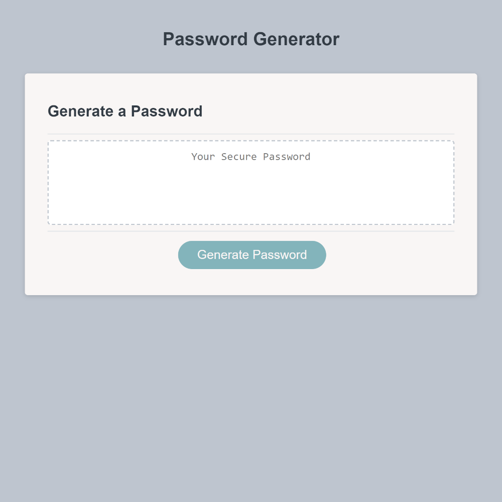

# Password Generator
A UC Berkley Full Stack Web Development Bootcamp Week 03 Challenge

## Description

The week 03 bootcamp challenge was to create a password generator using JavaScript with the following requirements: Use prompts and confirms for the user to be able to generate a random password with a length of 8 to 128 characters, with the user choosing what type of characters should be in the password (i.e. uppercase, lowercase, numbers, special characters, etc.).

## GitHub Pages

Visit the GitHub pages link to see website: [Password Generator](https://torvec.github.io/m3_password_generator/)

## Visuals

## Usage

This page is used for grading purposes by the UC Berkley coding bootcamp staff.

## Credits

- Starter Code: [GitHub Repo](https://github.com/coding-boot-camp/friendly-parakeet)
- OWASP Special Character List: [OWASP Site](https://owasp.org/www-community/password-special-characters)
- Edward Von Schondorf

## Features

- JavaScript Random Password Generator

## Project Status

Completed May 2023